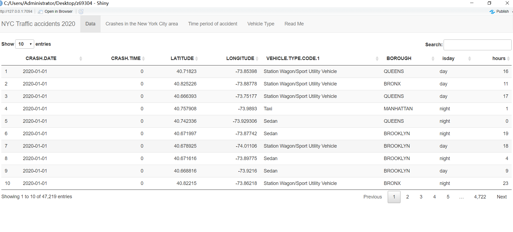
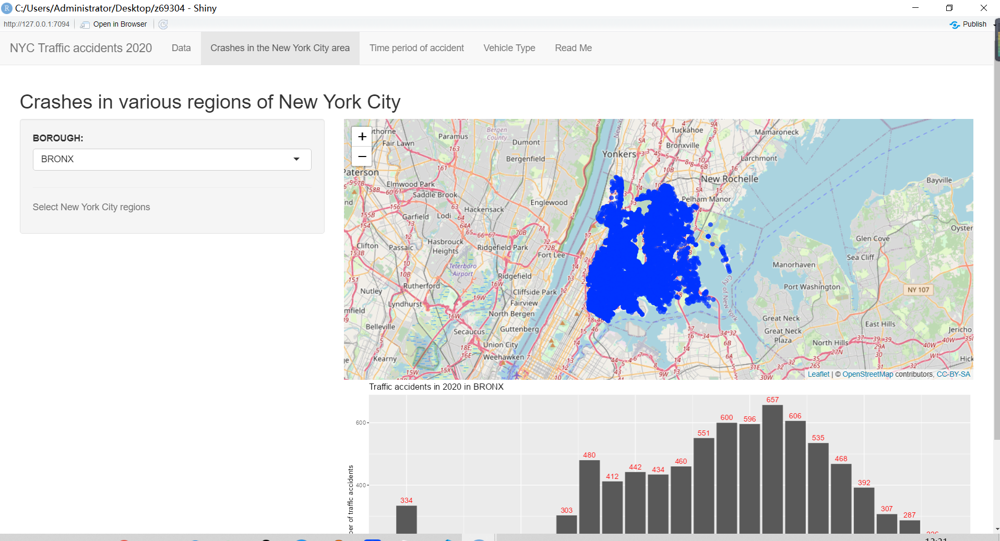
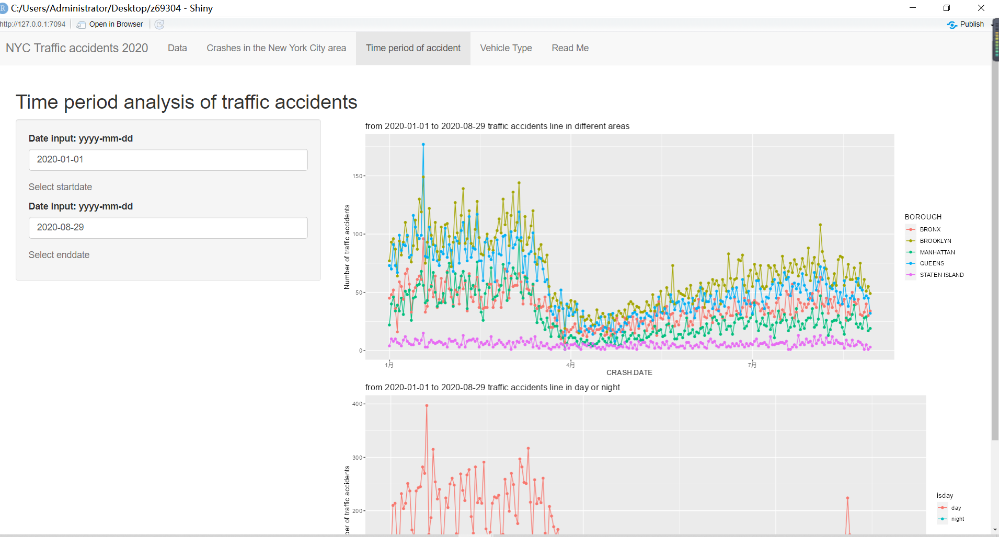
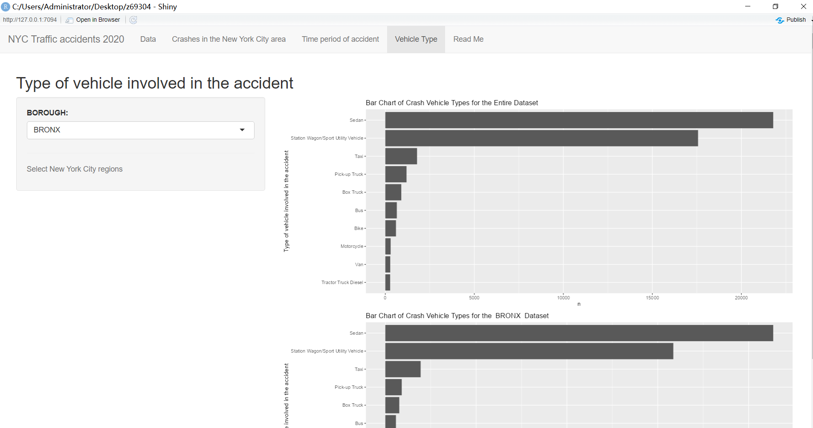

The data provided are the traffic accidents in New York City from 202001 to December 2020:
1. Figure 1 is a geographical map with a histogram, in the form of partitions (QUEENS, BROOKLYN etc). With regard to the traffic accidents in various regions of New York City, the main purpose is to distinguish the differences in the number of traffic accidents in each region.
2. The second part explores the main time periods of car accidents, comparing day and night, and comparing different types
3. The third part explores what types of cars are most involved in accidents,

